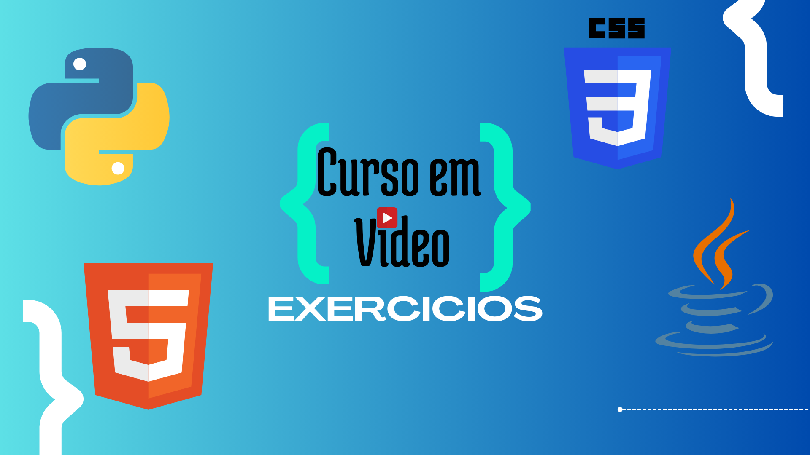

<h1 align="center">
  Curso em Video - Exercícios
<h1>

  
  
  
  
  

  
  
  

<section align="center">
  
</section>

###

🔗 Repositório dos execícios - **Python**

- **_Mundo 1_** ✅
- Mundo 2 - Em progresso (...)
- Mundo 3 - Em progresso (...)

###

🔗 Repositório dos execícios - **Java**

- Java Básico - Em progresso (...)
- POO - Em progresso (...)

---

**✏️ Linguagens:**

- [Python](https://www.python.org/)
- [Java](https://docs.oracle.com/javase/8/docs/api/)

**🚀 Tecnologias:**

- [Intellij IDEA](https://www.jetbrains.com/idea/)
- [Git](https://git-scm.com) | [GitHub](https://github.com)
